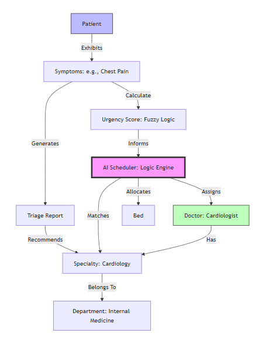
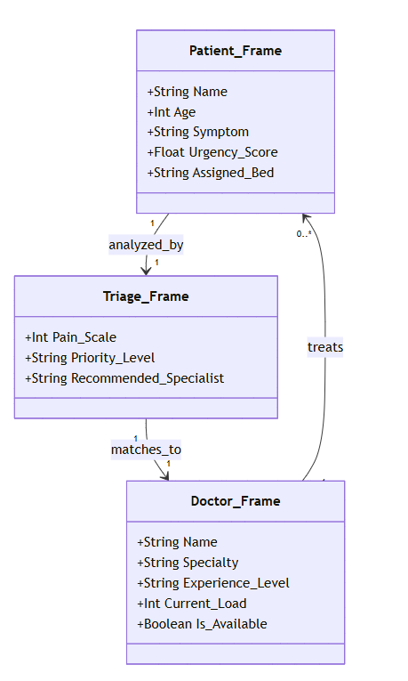

# Medi-Match: AI-Driven Hospital Resource Optimization & Triage

Medi-Match is an advanced healthcare management platform that integrates a modern **WPF (.NET) frontend** with a powerful **Python-based AI intelligence layer**.  
The system addresses the complex problem of **hospital resource allocation** and **emergency patient prioritization** using **Evolutionary Computing, Fuzzy Logic, and Rule-Based Expert Systems**.


##  Group Members

- **Afia Aziz** — ID: 231561  
- **Zumer Dhillun** — ID: 231597  
- **Zoya Azad** — ID: 231579  


##  Project Summary

In modern healthcare environments, manual scheduling of patients to doctors is inefficient and prone to human error.  
**Medi-Match** automates the patient-to-doctor assignment process by intelligently analyzing urgency, specialty requirements, and doctor workload.


##  Core Features

- **AI Scheduler**  
  Matches patients to doctors based on specialty, workload, and urgency.

- **Emergency Triage System**  
  Evaluates patient symptoms to calculate an urgency score (1–10) and recommends an appropriate specialist  
  (e.g., Cardiologist for chest pain).

- **Optimization Engines**
  - Fast **Heuristic Scheduler**
  - Globally optimal **Genetic Algorithm Scheduler**

- **Data Visualization**  
  Real-time convergence graphs showing AI performance.

- **Professional Reporting**  
  Automated **HTML** and **Text-based** clinical triage reports.


##  AI Techniques Used & Justification

### 1. Fuzzy Logic (Urgency Normalization)

**Implementation:**  
The `calculate_fuzzy_score` function converts discrete urgency levels (1–10) into a continuous fuzzy range \([0, 1]\).

**Justification:**  
Medical urgency is not binary. Fuzzy logic handles uncertainty and allows smoother prioritization of patients.


### 2. Genetic Algorithm (Evolutionary Optimization)

**Implementation:**  
Implemented in `scheduler_ga.py` using:
- Tournament Selection  
- Two-Point Crossover  
- Mutation  
- 120 Generations  

**Justification:**  
Hospital scheduling is an **NP-Hard problem**. Genetic Algorithms efficiently explore large search spaces to find globally optimal schedules.


### 3. Rule-Based Expert System (Clinical Mapping)

**Implementation:**  
Uses a clinical knowledge base (`SPECIALTY_CONDITIONS`) to map symptoms and diseases to medical specialties.

**Justification:**  
In healthcare, transparency is critical. Rule-based systems provide **explainable and auditable** decision-making.


### 4. Heuristic Greedy Search

**Implementation:**  
A scoring-based heuristic algorithm that selects locally optimal assignments.

**Justification:**  
Provides fast, real-time scheduling when deep optimization is not required.


##  Knowledge Representation

### 1. Semantic Network Diagram

Represents relationships between:
- Symptoms  
- Medical Departments  
- AI Scheduling Logic  




### 2. Frame-Based Representation

Defines medical entities using **slots and fillers**:
- Patient  
- Doctor  
- Triage  




##  Setup & Run Instructions

###  Prerequisites

- **Visual Studio 2022** (with .NET Framework 4.7.2)
- **Python 3.8+** (added to System PATH)


### Required Python Libraries

```bash
pip install numpy matplotlib
````


##  Running the Project

### 1. Clone the Repository

```bash
git clone https://github.com/YourUsername/Medi-Match.git
```

### 2. Open the Solution

Open the `.sln` file in **Visual Studio**.

### 3. Build

Clean and rebuild the solution.

### 4. Run

Press **F5** to launch the WPF application.


##  Application Usage

* **Triage Module:**
  Assess emergency patients and generate clinical reports.

* **Scheduler Module:**
  Enter hospital resources and run AI-based optimization.

* **Graphs Page:**
  View convergence graphs showing AI performance.


##  Project Structure

```
HospitalSchedulerUI/
│
├── WPF Frontend (C# / XAML)
│
├── Backend/
│   └── PythonScripts/
│       ├── scheduler.py          # Heuristic Scheduler
│       ├── scheduler_ga.py       # Genetic Algorithm
│       └── triage_calculator.py  # Emergency Triage Logic
│
├── Results/
│   ├── output.json
│   ├── metrics.csv
│   └── convergence.png
```


##  Sample Result Contract

The system ensures reliability using a strict **JSON input/output contract**.

### Sample `input.json`

```json
{
  "Doctors": 3,
  "Patients": 5,
  "DoctorDetails": [
    { "Name": "Dr. Smith", "Specialty": "Cardiology" }
  ],
  "Urgency": [9, 4, 2, 8, 5]
}
```


##  License

This project was developed as part of the **Artificial Intelligence course** and is distributed for **educational purposes only**.
