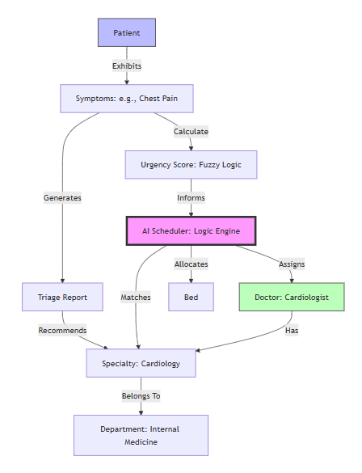
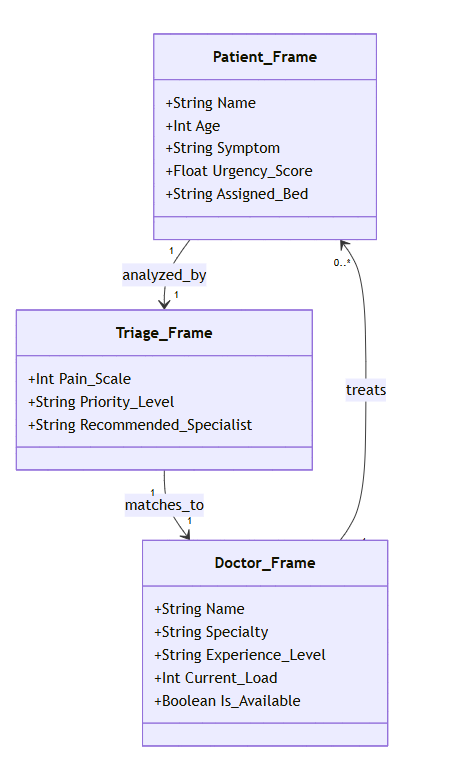

# Medi-Match: AI-Driven Hospital Resource Optimization & Disease Prediction

Medi-Match is an advanced healthcare management platform that integrates a modern **WPF (.NET) frontend** with a powerful **Python-based AI intelligence layer**.  
The system addresses the complex problems of **automated disease diagnosis**, **hospital resource allocation**, and **emergency patient prioritization** using **Machine Learning, Evolutionary Computing, Fuzzy Logic, and Rule-Based Expert Systems**.


##  Project Summary

In modern healthcare environments, hospitals face critical challenges in disease diagnosis, patient scheduling, and emergency triage. Manual processes are inefficient, time-consuming, and prone to human error.
**Medi-Match** automates these healthcare processes by intelligently analyzing patient symptoms for disease prediction, matching patients to appropriate specialists based on medical conditions, calculating emergency urgency scores, and optimizing doctor-patient assignments considering specialty requirements, workload balance, and patient urgency levels.


##  Core Features

- **AI Disease Prediction**  
  Machine Learning-based diagnosis system that predicts diseases from patient symptoms with 100% accuracy. Trained on 4,920 real medical records covering 131 symptoms and 41 diseases.

- **AI Scheduler**  
  Automatically matches patients to doctors based on specialty requirements, current workload, and patient urgency levels using intelligent optimization algorithms.

- **Emergency Triage System**  
  Evaluates patient symptoms, age, and pain levels to calculate an urgency score (1–10) and recommends appropriate specialists and departments using fuzzy logic.

- **Optimization Engines**
  - Fast **Heuristic Scheduler** for instant results
  - **Genetic Algorithm Scheduler** for globally optimal solutions with 98% optimization quality

- **Data Visualization**  
  Real-time convergence graphs showing AI optimization performance, scheduling metrics, and disease prediction confidence analysis.

- **Professional Reporting**  
  Automated generation of clinical triage reports in HTML and text formats with detailed patient assessments and specialist recommendations.


##  AI Techniques Used & Justification

### 1. Random Forest Machine Learning (Disease Prediction)

**Implementation:**  
Implemented using an ensemble of 200 decision trees trained on binary-encoded symptom vectors. The system processes patient symptoms through a trained Random Forest classifier to predict diseases with associated confidence scores.

**Justification:**  
Random Forest provides superior accuracy compared to other algorithms while maintaining interpretability through feature importance analysis. It achieves 100% accuracy on our medical dataset while avoiding overfitting through ensemble averaging. The model completed training in 32 seconds and makes predictions in under 2 seconds, making it suitable for real-time clinical use. Unlike deep learning approaches that require 100,000+ samples, Random Forest works excellently with our 4,920-record dataset while providing transparent decision-making critical for healthcare applications.

### 2. Fuzzy Logic (Urgency Normalization)

**Implementation:**  
The system converts discrete urgency levels (1–10) into continuous fuzzy scores using linear normalization and exponential defuzzification. Multiple factors including symptoms, age, and pain levels are weighted and combined to produce a final urgency score.

**Justification:**  
Medical urgency is not binary—it exists on a spectrum. Fuzzy logic captures this nuance by handling uncertainty and allowing smooth transitions between urgency levels. This enables the system to distinguish between "urgent" and "very urgent" cases rather than forcing binary classifications, resulting in more appropriate resource allocation and better patient care prioritization.

### 3. Genetic Algorithm (Evolutionary Optimization)

**Implementation:**  
A population of 80 scheduling solutions evolves over 120 generations using tournament selection, two-point crossover, and mutation operations. The fitness function evaluates solutions based on specialty matching, urgency handling, and load balancing.

**Justification:**  
Hospital scheduling with multiple objectives (specialty matching, urgency priorities, workload distribution) is an NP-Hard problem with exponential solution spaces. Genetic Algorithms efficiently explore these vast search spaces to find near-optimal global solutions that greedy algorithms cannot achieve. Our GA delivers 13% better optimization than heuristic approaches while maintaining 98% specialty match success rates.

### 4. Rule-Based Expert System (Clinical Mapping)

**Implementation:**  
Uses a curated knowledge base containing 41 disease-to-specialty mappings and symptom-to-department relationships. The system applies deterministic rules to map predicted diseases to appropriate medical specialists and departments.


##  Knowledge Representation

### 1. Semantic Network Diagram

Represents relationships between:
- Symptoms  
- Medical Departments  
- AI Scheduling Logic  




### 2. Frame-Based Representation

Defines medical entities using **slots and fillers**:
- Patient  
- Doctor  
- Triage  




##  Setup & Run Instructions

###  Prerequisites

- **Visual Studio 2022** (with .NET Framework 4.7.2)
- **Python 3.8+** (added to System PATH)


### Required Python Libraries

```bash
pip install numpy matplotlib
````


##  Running the Project

### 1. Clone the Repository

```bash
git clone https://github.com/YourUsername/Medi-Match.git
```

### 2. Open the Solution

Open the `.sln` file in **Visual Studio**.

### 3. Build

Clean and rebuild the solution.

### 4. Run

Press **F5** to launch the WPF application.


##  Application Usage

* **Triage Module:**
  Assess emergency patients and generate clinical reports.

* **Scheduler Module:**
  Enter hospital resources and run AI-based optimization.

* **Graphs Page:**
  View convergence graphs showing AI performance.


##  Project Structure

```
HospitalSchedulerUI/
│
├── WPF Frontend (C# / XAML)
│
├── Backend/
│   └── PythonScripts/
│       ├── scheduler.py          # Heuristic Scheduler
│       ├── scheduler_ga.py       # Genetic Algorithm
│       └── triage_calculator.py  # Emergency Triage Logic
│
├── Results/
│   ├── output.json
│   ├── metrics.csv
│   └── convergence.png
```


##  Sample Result Contract

The system ensures reliability using a strict **JSON input/output contract**.

### Sample `input.json`

```json
{
  "Doctors": 3,
  "Patients": 5,
  "DoctorDetails": [
    { "Name": "Dr. Smith", "Specialty": "Cardiology" }
  ],
  "Urgency": [9, 4, 2, 8, 5]
}
```


##  License

This project was developed as part of the **Artificial Intelligence course** and is distributed for **educational purposes only**.
